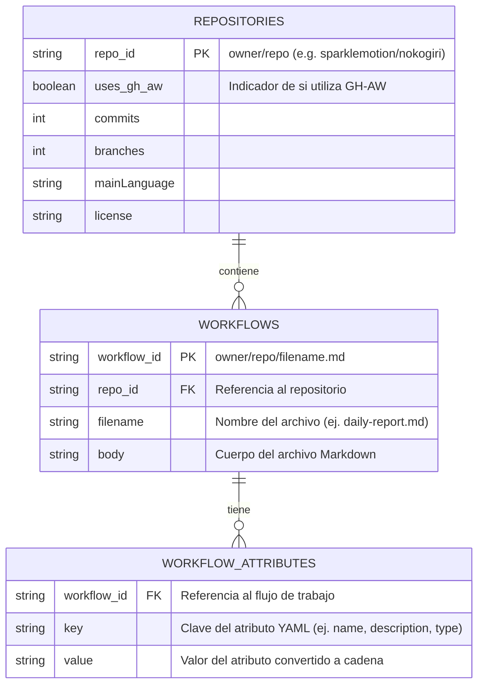

# Diagrama Entidad-Relación (GH-AW)

Este diagrama representa el modelo relacional generado a partir de la extracción de archivos Markdown de GitHub Agentic Workflows.

```mermaid
erDiagram
    REPOSITORIES ||--o{ WORKFLOWS : "contiene"
    WORKFLOWS ||--o{ WORKFLOW_ATTRIBUTES : "tiene"

    REPOSITORIES {
        string repo_id PK "owner/repo (e.g. sparklemotion/nokogiri)"
        boolean uses_gh_aw "Indicador de si utiliza GH-AW"
        int commits
        int branches
        string mainLanguage
        string license
    }

    WORKFLOWS {
        string workflow_id PK "owner/repo/filename.md"
        string repo_id FK "Referencia al repositorio"
        string filename "Nombre del archivo (ej. daily-report.md)"
        string body "Cuerpo del archivo Markdown"
    }

    WORKFLOW_ATTRIBUTES {
        string workflow_id FK "Referencia al flujo de trabajo"
        string key "Clave del atributo YAML (ej. name, description, type)"
        string value "Valor del atributo convertido a cadena"
    }
```
